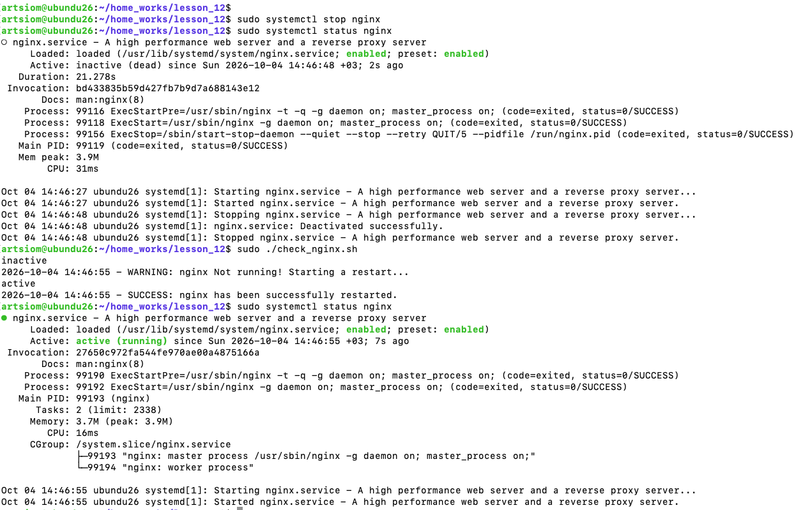

1. Написать скрипт, который запрашивает имя пользователя и выводит персонализированное приветствие
```
#!/bin/bash

max_attempts=3

for ((attempt=1; attempt<=max_attempts; attempt++)); do
  read -p "Введите ваше имя: " username

  if [ -n "$username" ]; then
    echo "Приветствую $username!"
    exit 0
  fi

  echo "Имя не может быть пустым. Осталось попыток: $((max_attempts - attempt))"
done

echo "Имя не введено. Возвращайся позже"
exit 1
```

2. Установить nginx (sudo apt install -y nginx) и написать скрипт для мониторинга состояния демона nginx (systemctl status) с
и автоматическим перезапуском (systemctl restart), если он не запущен
```
#!/bin/bash

SERVICE="nginx"

if ! systemctl is-active "$SERVICE"; then
  echo "$(date '+%Y-%m-%d %H:%M:%S') - WARNING: $SERVICE Not running! Starting a restart..."
  systemctl restart "$SERVICE"

  if systemctl is-active "$SERVICE"; then
    echo "$(date '+%Y-%m-%d %H:%M:%S') - SUCCESS: $SERVICE has been successfully restarted."
  else
    echo "$(date '+%Y-%m-%d %H:%M:%S') - ERROR: Failed to restart $SERVICE!"
    fi
fi 
```



3. Написать скрипт для мониторинга доступности хоста (можно использовать ping) с записью результата в лог с датой и временем (формат произвольный).
```

```
